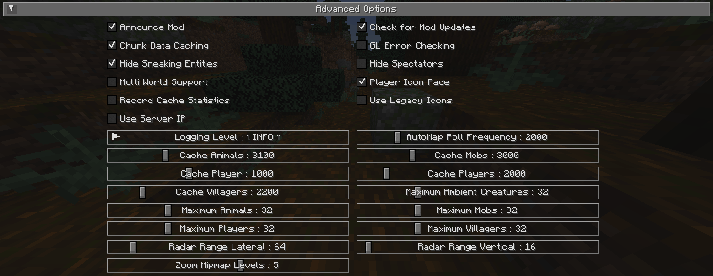

# **Advanced Settings**

This section contains advanced settings for power users and those that may wish to tweak some of JourneyMap’s internals.

!!! warning "Warning"

    The settings in this section can have extreme effects on the performance of your client. We don’t recommend touching these settings unless you have a good understanding of what you’re doing, or you’re directed to do so by a member of the JourneyMap support staff.

    If tweaking these settings crashes your client or causes your computer to lag horribly, don’t say we didn’t warn you.

{: .center}
{: .center}

## **Toggles**

The **bold** toggle settings below are enabled by default.

| Toggle                     | Description                                                                                                                                             |
| -------------------------- | ------------------------------------------------------------------------------------------------------------------------------------------------------- |
| **Announce Mod**           | Whether to announce in chat when JourneyMap is ready to use                                                                                             |
| **Check for Mod Updates**  | Whether JourneyMap should check for updates on Curse                                                                                                    |
| **Chunk Data Caching**     | Enables or disables chunk caching                                                                                                                       |
| GL Error Checking          | Enables or disables OpenGL error checking                                                                                                               |
| **Hide Sneaking Entities** | Whether sneaking/crouching creatures should be hidden                                                                                                   |
| Hide Spectators            | Whether spectators should be hidden on the radar                                                                                                        |
| **High Display Quality**   | Uncheck to improve zoom performance and memory usage, but reduce  display quality and lower performance of minimap rotation when set to “My Heading” |
| Multi-World Support        | Enables or disables multi-world support - Note: this may not work for all servers.                                                                      |
| **Player Icon Fade**       | Enables or Disables Player Icons from fading based on vertical distance.                                                                                |
| Record Cache Statistics    | This is intended for beta testers - enable to record statistics for each cache                                                                          |
| Use Legacy Icons           | Use the mob icons that come with JourneyMap instead of automatically generated ones or those that come in resource packs.                               |
| Use Server IP              | Use Server IP address in data saving to help keep maps unique.                                                                                          |

## **Other Settings**

The default option for each setting below is marked with **bold text.**

| Setting                | Options                                                                                                   | Description                                                                                                                                      |
| ---------------------- | --------------------------------------------------------------------------------------------------------- | ------------------------------------------------------------------------------------------------------------------------------------------------ |
| Logging Level          | <ul><li>**INFO**</li><li>ALL</li><li>ERROR</li><li>FATAL</li><li>DEBUG</li><li>OFF</li><li>WARN</li></ul> | Set how verbose JourneyMap's logs are, but note that some log levels can cause serious performance problems                                      |
| AutoMap Poll Frequency | Range: 500 - 10000 (in ms)  Default is **2000**                                                        | Delay between automap region tasks - lower values will make the map generate faster, but will cause significant performance drops while mapping  |
| Cache Animals          | Range: 1000 - 10000 (in ms)  Default is **3100**                                                       | How long radar data for animals is cached for - lower values will impact performance                                                             |
| Cache Mobs             | Range: 1000 - 10000 (in ms)  Default is **3000**                                                       | How long radar data for mobs is cached for - lower values will impact performance                                                                |
| Cache Player           | Range: 500 - 2000 (in ms)  Default is **1000**                                                         | How long data for your character is cached for - lower values will impact performance                                                            |
| Cache Players          | Range: 1000 - 10000 (in ms)  Default is **2000**                                                       | How long radar data is cached before checking for new villagers - lower values will impact performance                                           |
| Cache Villagers        | Range: 1000 - 10000 (in ms)  Default is **2200**                                                       | How long radar data for other players is cached for - lower values will impact performance                                                       |
| Maximum Animals        | Range: 1 - 128  Default is **32**                                                                      | Maximum number of animals displayed on the radar                                                                                                 |
| Maximum  Mobs       | Range: 1 - 128  Default is **32**                                                                      | Maximum number of mobs displayed on the radar                                                                                                    |
| Maximum Players        | Range: 1 - 128  Default is **32**                                                                      | Maximum number of players displayed on the radar                                                                                                 |
| Maximum Villagers      | Range: 1 - 128  Default is **32**                                                                      | Maximum number of villagers displayed on the radar                                                                                               |
| Radar Range Lateral    | Range: 16 - 512 (in blocks)  Default is **64**                                                         | Lateral distance to search for entities to display on the radar - high values will cause a significant performance hit                           |
| Radar Range Vertical   | Range: 8 - 256 (in blocks)  Default is **16**                                                          | Vertical distance to search for entities to display on the radar - high values will cause a significant performance hit                          |
| Zoom Minimap Levels    | Range: 0 - 0  Default is **5**                                                                         | The levels of mipmaps to generate for zooming out on the map. Increasing will create higher quality zoomed out images, but will use more memory. |
