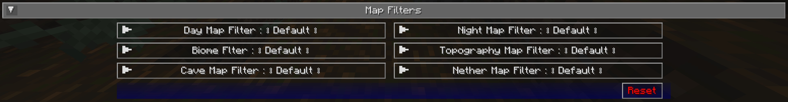

# **Map Filters**

This section allows doing a shader overlay of specific map types.

{: .center}

## **Other Settings**

The default option for each setting below is marked with **bold text.**

| Setting               | Options                                                                                                                  | Description                              |
| --------------------- | ------------------------------------------------------------------------------------------------------------------------ | ---------------------------------------- |
| Day Map Filter        | <ul><li>**Default**</li><li>Gray Scale</li><li>Sepia Variant 1</li><li>Sepia Variant 2</li><li>Sepia Variant 3</li></ul> | Apply the filter to the day map.         |
| Night Map Filter      | <ul><li>**Default**</li><li>Gray Scale</li><li>Sepia Variant 1</li><li>Sepia Variant 2</li><li>Sepia Variant 3</li></ul> | Apply the filter to the night map.       |
| Biome Filter          | <ul><li>**Default**</li><li>Gray Scale</li><li>Sepia Variant 1</li><li>Sepia Variant 2</li><li>Sepia Variant 3</li></ul> | Apply the filter to the biome map.       |
| Topography Map Filter | <ul><li>**Default**</li><li>Gray Scale</li><li>Sepia Variant 1</li><li>Sepia Variant 2</li><li>Sepia Variant 3</li></ul> | Apply the filter to the Topography map.  |
| Cave Map Filter       | <ul><li>**Default**</li><li>Gray Scale</li><li>Sepia Variant 1</li><li>Sepia Variant 2</li><li>Sepia Variant 3</li></ul> | Apply the filter to the cave map.        |
| Nether Map Filter     | <ul><li>**Default**</li><li>Gray Scale</li><li>Sepia Variant 1</li><li>Sepia Variant 2</li><li>Sepia Variant 3</li></ul> | Apply the filter to the nether cave map. |
