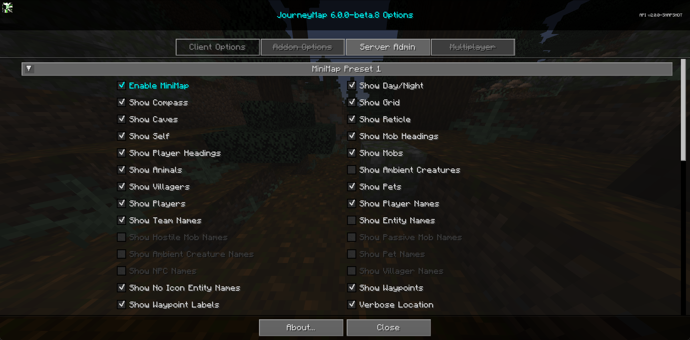
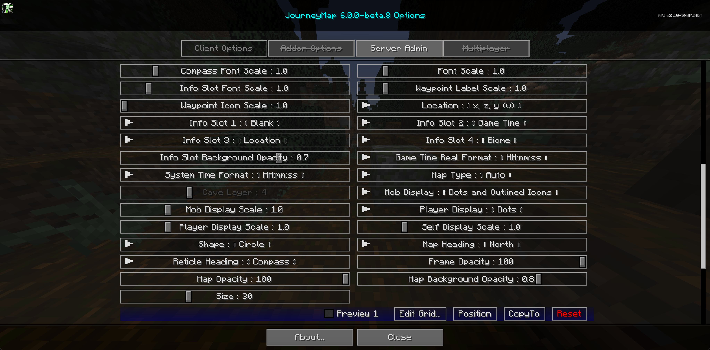

# **Minimap Settings**

JourneyMap allows you to have two minimap presets. Each preset represents a separate set of settings - essentially allowing you to have two distinct minimaps available to switch between.

!!! note "Note"

    The settings for each minimap are identical, so we’ll only cover a single preset below.

To switch between minimap presets, press the switch minimap preset key (the ++backslash++ key by default).

{: .center}
{: .center}

## **Toggles**

The **bold** toggle settings below are enabled by default.

| Toggle                        | Description                                                       |
| ----------------------------- | ----------------------------------------------------------------- |
| **Enable Minimap**            | Enable or disable this minimap preset                             |
| **Show Day/Night**            | Toggle automatically switching between day and night mode         |
| **Show Compass**              | Toggle showing compass points around the edge of the minimap      |
| **Show Grid**                 | Show or hide the grid overlay                                     |
| **Show Caves**                | Toggle automatically switching to cave mode                       |
| **Show Reticle**              | Show or hide midpoint lines pointing to the center of the minimap |
| **Show Self**                 | Show or hide your own location and heading                        |
| **Show Mob Headings**         | Toggle showing which way mobs are facing                          |
| **Show Player Headings**      | Toggle showing which way other players are facing                 |
| **Show Mobs**                 | Show or hide mobs                                                 |
| **Show Animals**              | Show or hide animals                                              |
| Show Ambient Creatures        | Show or hide nearby ambient creatures                             |
| **Show Villagers**            | Show or hide villagers                                            |
| **Show Pets**                 | Show or hide pets                                                 |
| **Show Players**              | Show or hide other players                                        |
| **Show Player Names**         | Show or hide player names on the map                              |
| **Show Team Names**           | Show or hide team names on the map                                |
| Show Entity Names             | Show or hide entity names on the map                              |
| Show Hostile Mob Names        | Show or hide hostile mob names on the map                         |
| Show Passive Mob Names        | Show or hide passive mob names on the map                         |
| Show Ambient Creatures        | Show or hide nearby ambient creatures                             |
| Show Pet Names                | Show or hide pet names on the map                                 |
| Show NPC Names                | Show or hide NPC names on the map                                 |
| Show Villager Names           | Show or hide villager names on the map                            |
| **Show No Icon Entity Names** | Show or hide entity names on the map                              |
| **Show Waypoints**            | Show or hide all waypoints                                        |
| **Show Waypoint Labels**      | Show or hide the names of waypoints                               |
| **Verbose Location**          | Toggle between a long or short form of your current coordinates   |

## **Info Slots**

Info slots are text areas above and below the minimap that show extra contextual information. There are four of them,
numbered from top to bottom.

{: .center}

All info slots can be set to one of the following:

- **Blank**: Nothing, hide this info slot
- **Biome**: The biome you're currently in
- **Dimension**: The dimension you're currently in
- **FPS**: The game's FPS counter
- **Game Time**: The current ingame time, as represented by Minecraft's daylight cycle
- **Game Time Real**: The current ingame time, shifted to match a real clock
- **Light Level**: The light level of the block you're standing in
- **Location**: Your current coordinates
- **Moon Phase**: The current moon phase
- **Movement Speed**: Movement speed in blocks per second
- **Region**: Your current region coordinates
- **System Time**: The current real time, according to your computer
- **Weather**: Current weather for the dimension you're in

## **Other Settings**

The default option for each setting below is marked with **bold** text.

| Setting                      | Options                                                                                                                                                                                                  | Description                                                                                         |
| ---------------------------- | -------------------------------------------------------------------------------------------------------------------------------------------------------------------------------------------------------- | --------------------------------------------------------------------------------------------------- |
| Compass Font Scale           | <ul><li>Range: 0.5 - 4 **Default is 1**</li></ul>                                                                                                                                                        | The font scale used for compass point labels                                                        |
| Font Scale                   | <ul><li>Range: 0.5 - 5 **Default is 1**</li></ul>                                                                                                                                                        | The font scale for labels and text                                                                  |
| Info Slot Font Scale         | <ul><li>Range: 0.5 - 5 **Default is 1**</li></ul>                                                                                                                                                        | The font scale for labels and text                                                                  |
| Waypoint Label Scale         | <ul><li>Range: 0.5 - 5  **Default is 1**</li></ul>                                                                                                                                                    | The font scale for waypoint labels on the map.                                                      |
| Waypoint Icon Scale          | <ul><li>Range: 1 - 5  **Default is 1**</li></ul>                                                                                                                                                      | The scale of waypoint icons on the map.                                                             |
| Location                     | <ul><li>**x, z, y (v)**</li><li>x, y, (v), z</li><li>x, z, y</li><li>x, y, z</li><li>x, z</li></ul>                                                                                                      | The format of your coordinates, as shown on the map.                                                |
| Info Slot Background Opacity | <ul><li>Range: 0 - 1  **Default is 0.7**</li></ul>                                                                                                                                                    | Adjust the opacity of the Info Slot background.                                                     |
| Game Time Real Format        | <ul><li>**HH:mm:ss**</li><li>H:mm:ss</li><li>HH:mm</li><li>H:mm</li><li>hh:mm:ss a</li><li>h:mm:ss a</li><li>hh:mm:ss</li><li>h:mm:ss</li><li>h:mm a</li><li>h:mm a</li><li>hh:mm</li><li>h:mm</li></ul> | The text format of the real game time, as shown in an info slot.                                    |
| System Time Format           | <ul><li>**HH:mm:ss**</li><li>H:mm:ss</li><li>HH:mm</li><li>H:mm</li><li>hh:mm:ss a</li><li>h:mm:ss a</li><li>hh:mm:ss</li><li>h:mm:ss</li><li>h:mm a</li><li>h:mm a</li><li>hh:mm</li><li>h:mm</li></ul> | The text format of the system time, as shown in an info slot.                                       |
| Map Type                     | <ul><li>**Auto**</li><li>Biome</li><li>Day</li><li>Night</li><li>Topo</li><li>Underground</li></ul>                                                                                                      | The type of map to display.                                                                         |
| Cave Layer                   | <ul><li>Range: -4 - 15 **Default is 4**</li></ul>                                                                                                                                                        | Lock the minimap when set to underground                                                            |
| Mob Display                  | <ul><li>**Dots and Outlined Icons**</li><li>Dots</li><li>Icons</li><li>Outlined Icons</li><li>Dots and Icons</ul>                                                                                        | How mobs should be displayed on the map.                                                            |
| Mob Display Scale            | <ul><li>Range: 0.01 - 5  **Default is 1**</li></ul>                                                                                                                                                   | The scale of Mob icons and dots on the map.                                                         |
| Player Display               | <ul><li>**Dots and Outlined Icons**</li><li>Dots</li><li>Icons</li><li>Outlined Icons</li><li>Dots and Icons</ul>                                                                                        | How other players should be displayed on the map.                                                   |
| Player Display Scale         | <ul><li>Range: 0.01 - 5  **Default is 1**</li></ul>                                                                                                                                                   | The scale of Player icons and dots on the map.                                                      |
| Self Display Scale           | <ul><li>Range: 0.01 - 5  **Default is 1**</li></ul>                                                                                                                                                   | The scale of your own icon on the map.                                                              |
| Shape                        | <ul><li>**Circle**</li><li>Square</li><li>Rectangle</li></ul>                                                                                                                                            | Change the shape of the minimap.                                                                    |
| Map Heading                  | <ul><li>**North**</li><li>Old North</li><li>My Heading</li></ul>                                                                                                                                         | The orientation (rotation) of the MiniMap. Note: Only Circle supports the "My Heading" Map Heading. |
| Reticle Heading              | <ul><li>**Compass**</li><li>My Heading</li></ul>                                                                                                                                                         | Change the orientation of the reticle.                                                              |
| Frame Opacity                | <ul><li>Range 0 - 100  **Default is 100**</li><ul>                                                                                                                                                    | How opaque the frame around the outside of the minimap should be                                    |
| Map Opacity                  | <ul><li>Range 0 - 100  **Default is 100**</li><ul>                                                                                                                                                    | How opaque the map view itself should be                                                            |
| Map Background Opacity       | <ul><li>Range: 0 - 1  **Default is 0.8**</li></ul>                                                                                                                                                    | Adjust how opaque the MiniMap frame is (as a percentage)                                            |
| Size                         | <ul><li>Range 0 - 100  **Default is 30**</li><ul>                                                                                                                                                     | How large the minimap should be, as a percentage of the window size                                 |
